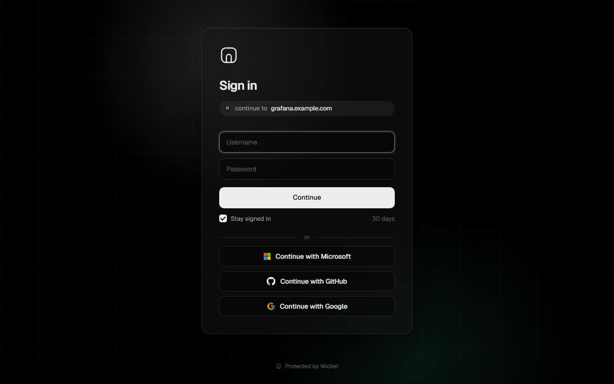
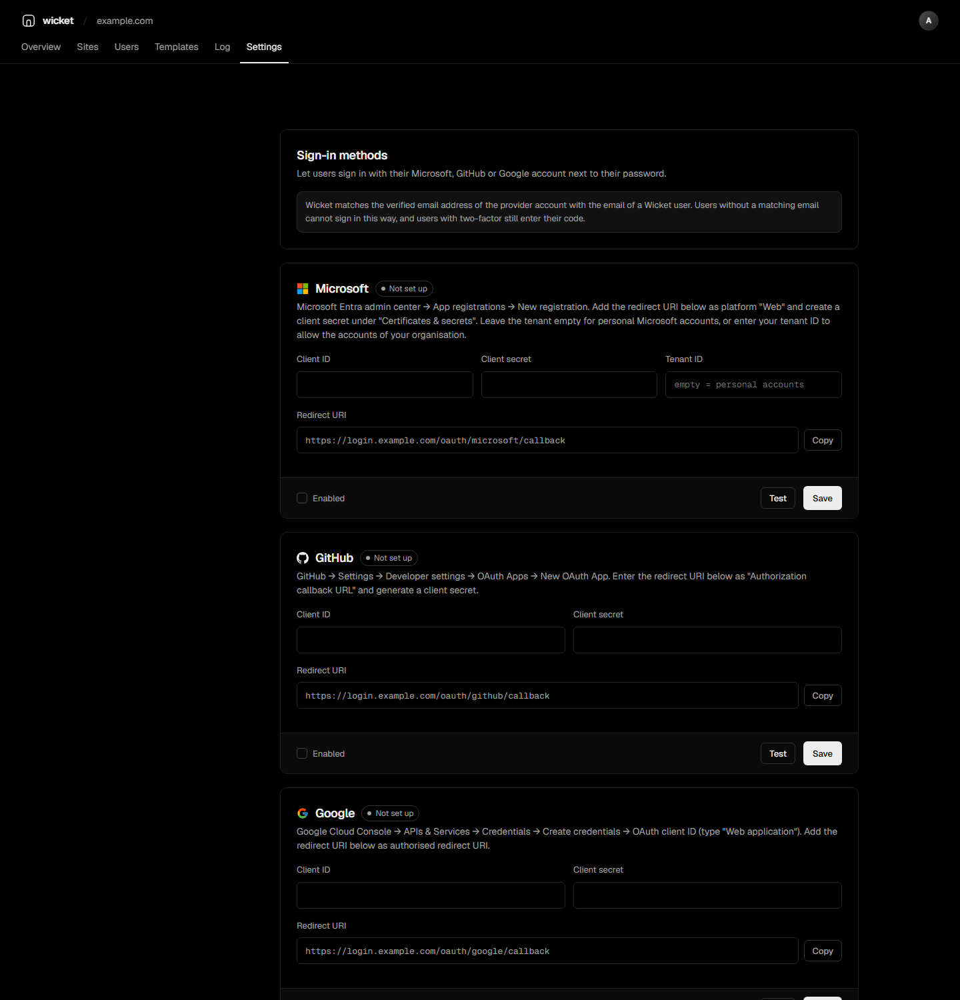
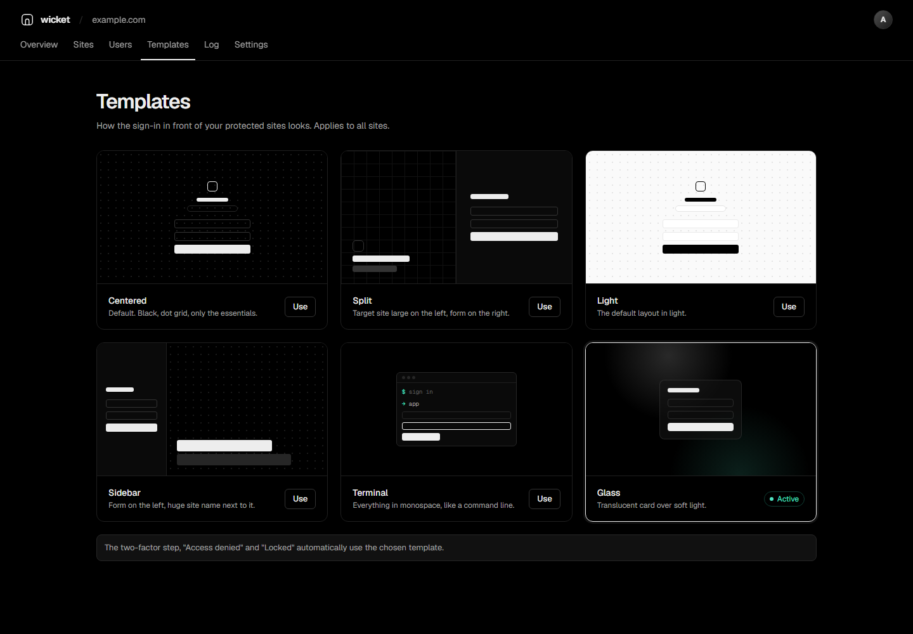
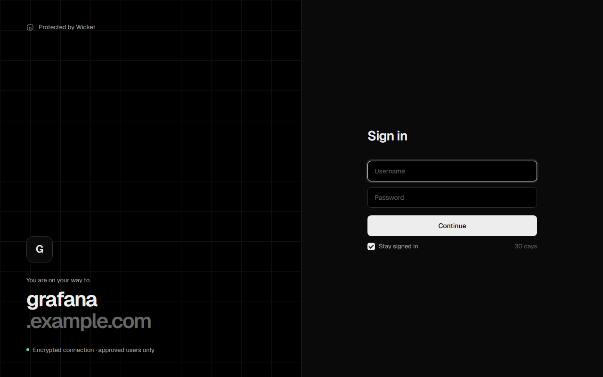
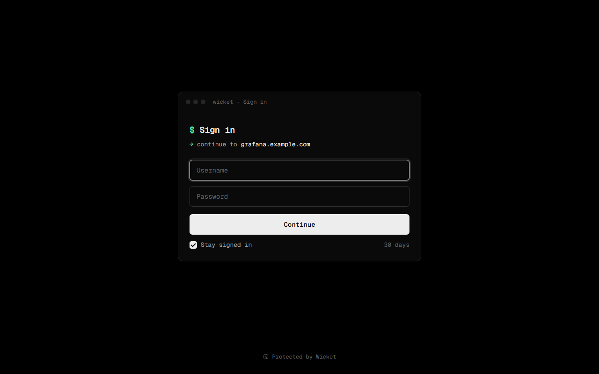

# Wicket

Wicket is a small, self-hosted login gate for [Caddy](https://caddyserver.com), Traefik and nginx. Put it in front
of any website or service on your server and every visitor has to sign in first: one login page, single sign-on
across all your subdomains, passkeys and two-factor authentication, groups, brute-force protection and an audit log.
Other applications can use Wicket as their OpenID Connect login. It ships as a single Docker image and stores
everything in one SQLite file.


| Login in front of a protected site | Admin login |
|---|---|
|  |  |

## Contents

- [Features](#features)
- [How it works](#how-it-works)
- [Requirements](#requirements)
- [Installation](#installation)
- [Protecting a site](#protecting-a-site)
- [Sign in with Microsoft, GitHub and Google](#sign-in-with-microsoft-github-and-google)
- [Passkeys](#passkeys)
- [Groups and roles](#groups-and-roles)
- [Mail server, invitations and password reset](#mail-server-invitations-and-password-reset)
- [Notifications](#notifications)
- [Login for other applications (OpenID Connect)](#login-for-other-applications-openid-connect)
- [Traefik and nginx](#traefik-and-nginx)
- [Docker containers as target](#docker-containers-as-target)
- [Metrics](#metrics)
- [Updates](#updates)
- [Admin interface](#admin-interface)
- [Configuration](#configuration)
- [Security](#security)
- [Backup and updates](#backup-and-updates)
- [Building from source](#building-from-source)
- [Changelog](#changelog)
- [Roadmap](#roadmap)

## Features

- **Own login page** instead of the browser's basic-auth popup, with six templates to choose from.
- **Single sign-on.** One login is valid for every protected site under your domain.
- **Sign in with Microsoft, GitHub and Google** next to the password, matched to existing users by email.
- **English, German and Spanish.** Choose a language or let Wicket follow each visitor's browser.
- **Per-site rules.** Allow all users, admins only, or selected users and groups.
- **Groups and roles.** Manage access for many users at once. Besides admins and users there is a read-only
  auditor role.
- **Public paths.** Keep individual paths open, for example `/healthz` or `/api/public/*`.
- **IP rules per site.** Always allow networks without login, or always block them.
- **Session length per site.** Ask for a fresh sign-in on sensitive sites after a set number of hours.
- **Passkeys.** Sign in with fingerprint, face or device PIN instead of password and code.
- **Two-factor authentication** with any authenticator app (TOTP), including ten single-use recovery codes.
  2FA can be required per site and enforced for all admins.
- **Invitations and password reset by email** through your own SMTP server.
- **Notifications** by email, webhook or ntfy, for example on a sign-in from a new device.
- **OpenID Connect provider.** Applications like Grafana, Portainer or Gitea can use Wicket for their login.
- **Caddy, Traefik and nginx.** Ready-made snippets for all three.
- **Own branding** with your name, logo, accent colour and footer on the login pages.
- **Docker containers as target.** Pick a running container when you add a site.
- **Prometheus metrics** for sign-ins, checks and locks.
- **Updates from the admin interface.** Wicket tells you about new releases and installs them through Watchtower.
  A release can be marked as required, which locks older versions until they are updated.
- **Brute-force protection.** An IP address is locked for a configurable time after repeated failed attempts.
- **Audit log** of every sign-in, failure, lock and admin change, with filters and CSV export.
- **Session management.** See active sessions per user and end them individually or all at once.
- **Automatic Caddy configuration.** Add a domain in the admin interface and Wicket writes the Caddy site block
  and reloads Caddy. The site is protected immediately.
- **Admin interface in tabs** with a search across all settings that understands English, German and Spanish terms.
- **Small and self-contained.** One static binary, no external services. The only outgoing request is the update
  check against GitHub, which can be turned off.

## How it works

```
Browser ──> Caddy ──(forward_auth)──> Wicket  /verify
              │                          │
              │   200 + Remote-User  <───┤  signed in and allowed
              │   302 to login page  <───┘  not signed in or not allowed
              ▼
         your service
```

1. Caddy asks Wicket before every request to a protected site (`forward_auth`).
2. If the visitor has a valid session and is allowed on that site, Wicket answers `200` and Caddy forwards the
   request. Wicket adds the headers `Remote-User`, `Remote-Role`, `Remote-Email` and `Remote-Groups`, which your
   service can use.
3. Otherwise the visitor is redirected to the Wicket login page and sent back after signing in.
4. The session cookie is set for your main domain, so it is valid on all subdomains.

## Requirements

- A Linux server with Docker.
- [Caddy](https://caddyserver.com) v2 as reverse proxy, running on the same host. Traefik and nginx work as well
  (see [Traefik and nginx](#traefik-and-nginx)); the automatic site configuration is only available with Caddy.
- A domain with DNS records for two hosts, for example `login.example.com` (login page) and
  `wicket.example.com` (admin interface). Both point to your server.

## Installation

### 1. Prepare the directories

Wicket runs as the unprivileged user `65532`. It needs a data directory and a directory for its Caddy snippets:

```
mkdir -p /opt/wicket/data
sudo mkdir -p /etc/caddy/wicket
sudo chown 65532:65532 /opt/wicket/data /etc/caddy/wicket
```

To let Wicket protect site blocks that already exist in your Caddyfile, also allow it to edit the Caddyfile:

```
sudo chgrp 65532 /etc/caddy/Caddyfile
sudo chmod 664 /etc/caddy/Caddyfile
```

Without this step everything still works, but you add `import wicket` to existing blocks yourself.

### 2. Include Wicket in your Caddyfile

If the Caddyfile is writable for Wicket (previous step), Wicket adds this line itself and skips to step 3.
Otherwise add it to the top of your Caddyfile, before any site block (after the global options block, if you
have one):

```
import /etc/caddy/wicket/*.caddy
```

Wicket keeps its own files in this directory: the `wicket` snippet with the `forward_auth` configuration, the
site block for the login and admin hosts, and one block per site it manages for you.

The line has to come first because Caddy defines snippets in the order it reads the file. A site block above it
that uses `import wicket` fails with `Could not import wicket: is a directory`.

### 3. Start the container

Create `/opt/wicket/docker-compose.yml`:

```yaml
services:
  wicket:
    image: ghcr.io/johanneshehl/wicket:latest
    container_name: wicket
    restart: unless-stopped
    network_mode: host
    environment:
      WICKET_LISTEN: 127.0.0.1:9091
      WICKET_COOKIE_DOMAIN: example.com
      WICKET_LOGIN_HOST: login.example.com
      WICKET_ADMIN_HOST: wicket.example.com
    volumes:
      - ./data:/data
      - /etc/caddy:/etc/caddy
```

```
cd /opt/wicket
docker compose up -d
```

Host networking lets Caddy reach Wicket on `127.0.0.1:9091` and Wicket reach the Caddy admin API on
`127.0.0.1:2019`. Wicket only listens on localhost; all public traffic goes through Caddy.

Optional additions to this file: the Docker socket for picking containers as target
([Docker containers as target](#docker-containers-as-target)) and an updater for updates from the admin interface
([Installing updates](#installing-updates)).

### 4. First-run setup

On the first start Wicket prints a one-time setup code:

```
docker logs wicket
```

Open `https://wicket.example.com`, enter the setup code and create the first admin account. In the next step you
confirm the domain and hosts, then you set up two-factor authentication. After that the admin interface opens.


## Protecting a site

Open **Sites** in the admin interface and click **Add domain**.

| Field | Meaning |
|---|---|
| Domain | The host name to protect, for example `app.example.com`. Wicket checks whether its DNS points to your server. |
| Target | Where the service runs, for example `127.0.0.1:8080` or `http://container:80`. Running Docker containers can be picked from a list. |
| Access | All users, admins only, or selected users and groups. Admins always have access. |
| Two-factor | Require 2FA for this site. Users without 2FA or a passkey are asked to set it up first. |
| Public paths | Paths that stay reachable without login. Exact paths or a prefix ending in `*`. |
| Always allow | IP addresses or networks (for example `192.168.1.0/24`) that reach the site without login. |
| Always block | IP addresses or networks that are refused with `403`. Blocking wins over allowing. |
| Sign in again after | Hours after which a sign-in no longer counts for this site. `0` uses the global session length. |
| Let Wicket create the Caddy block | Wicket writes and maintains the Caddy block for this domain. |

### Managed sites

With **Let Wicket create the Caddy block** enabled, Wicket creates this block and reloads Caddy:

```
app.example.com {
	import wicket
	reverse_proxy 127.0.0.1:8080
}
```

If Caddy rejects the configuration (for example because the domain is already defined in your Caddyfile),
Wicket restores the previous state and shows the error.

### Existing Caddy blocks

If a domain already has its own block in your Caddyfile, Wicket detects it while you type the domain and protects
that block instead of creating a second one. With a writable Caddyfile this is automatic:

- Wicket adds `import wicket # added by wicket` to the block.
- An existing `basic_auth` in the block is commented out (`# disabled by wicket: ...`), since Wicket replaces
  the browser's login popup.
- When you delete the site in Wicket, both changes are reverted.
- Before the first change, the original Caddyfile is saved as `Caddyfile.before-wicket` in the data directory.

```
app.example.com {
	import wicket # added by wicket
	# disabled by wicket: basic_auth {
	# disabled by wicket: 	admin $2a$14$...
	# disabled by wicket: }
	reverse_proxy 127.0.0.1:8080
}
```

If the Caddyfile is read-only for Wicket, add `import wicket` to the block yourself. This also works for wildcard
domains such as `*.apps.example.com`.

### Pausing protection

Every site has a switch in the list. A paused site stays reachable without login, and its rules are kept.

## Sign in with Microsoft, GitHub and Google

Users can sign in with an external account instead of their password. Wicket compares the verified email address
of that account with the email stored for the Wicket user. There is no automatic sign-up: without a matching
user the sign-in is refused. Users with two-factor authentication still enter their code afterwards.

1. Register an application with the provider. The redirect URI is shown in **Settings > Sign-in methods** and has
   the form `https://login.example.com/oauth/<provider>/callback`.
   - **Microsoft:** Entra admin center > App registrations > New registration. Add the redirect URI as platform
     "Web" and create a client secret under "Certificates & secrets".
   - **GitHub:** Settings > Developer settings > OAuth Apps > New OAuth App. Use the redirect URI as
     "Authorization callback URL".
   - **Google:** Google Cloud Console > APIs & Services > Credentials > OAuth client ID, type "Web application".
     Add the redirect URI as authorised redirect URI.
2. Enter the client ID and client secret in Wicket, tick **Enabled** and save.
3. Wicket first checks the credentials with the provider. The provider is only switched on if they are accepted;
   otherwise the error from the provider is shown and the data is kept. **Test** runs the same check without saving.

The buttons then appear on every login page and on the admin login.

For Microsoft, leave the tenant empty to allow personal Microsoft accounts. To allow the work accounts of your
organisation, enter its tenant ID. Without a tenant, work accounts are refused, because their email address is
not verified by Microsoft.



## Passkeys

Signed-in users add a passkey on the page shown after sign-in, admins also under **Settings > My account**. From then
on **Sign in with a passkey** appears on the login pages. A passkey replaces both the password and the second
factor, so sites that require 2FA accept it.

A passkey belongs to your main domain, so one passkey works on the login page and in the admin interface. Admins see
the passkeys of every user in the user panel and can remove them.

## Groups and roles

Create groups in the **Groups** tab and choose their members. A site or application limited to selected users also
admits the members of the chosen groups. Wicket passes the user's groups to your service in the `Remote-Groups`
header.

| Role | Can do |
|---|---|
| Admin | Everything, and access to every site. |
| Auditor | Sees the whole admin interface, including the audit log, but cannot change anything. |
| User | Signs in to the sites and applications they are allowed on. |

## Mail server, invitations and password reset

Wicket does not send email through a service of its own. Enter your own SMTP server under **Settings > Mail
server**: host, port, encryption (STARTTLS, TLS or none), user name, password and sender. **Save and send test**
sends a test message.

With a mail server configured:

- **Forgot password?** appears on the login pages. The reset link is valid for one hour and works once. Wicket
  gives the same answer for unknown accounts, so the form cannot be used to find user names.
- When you create a user you can send an invitation instead of setting a password. The user chooses the password
  through the link, which is valid for seven days.
- The user panel has **Send invitation** and **Send reset link**. A reset link sent by an admin is valid for 24 hours.

## Notifications

Under **Settings > Notifications** you add channels:

| Type | Target |
|---|---|
| Email | An email address. Uses the mail server above. |
| Webhook | A URL that receives a JSON message, for example from Slack, Discord or Teams. An optional token is sent as `Authorization: Bearer`. |
| ntfy | A topic URL such as `https://ntfy.sh/my-wicket`, with an optional access token. |

Each channel chooses its events: sign-in from a new device, IP address locked, admin signed in, settings changed,
new Wicket version.
**Send test** checks a saved channel.

## Login for other applications (OpenID Connect)

Wicket is an OpenID Connect provider. Applications such as Grafana, Portainer, Gitea or Nextcloud can send their
users to the Wicket login and get the signed-in user back.

1. Open **Settings > Apps (OIDC)** and click **New app**.
2. Enter a name and the redirect URIs of the application, and choose who may use it (all users, admins, or selected
   users and groups).
3. Wicket shows the client ID and the client secret. The secret is shown only once; **New secret** replaces it.
4. In the application, enter the client ID, the client secret and the discovery URL
   `https://login.example.com/.well-known/openid-configuration`.

| Detail | Value |
|---|---|
| Flow | Authorization code, with PKCE (`S256`) |
| Scopes | `openid`, `profile`, `email`, `groups` |
| Claims | `sub`, `preferred_username`, `name`, `email`, `email_verified`, `groups`, `role` |
| Signing | `ES256`; the key is created on first start and stored in the data directory |
| Client authentication | `client_secret_basic`, `client_secret_post`, or none for apps without a secret |

Apps without a secret, such as single-page or mobile apps, must use PKCE.

## Traefik and nginx

Wicket works with any reverse proxy that can ask an auth server before each request. **Settings > Integrations**
shows ready-made snippets with your addresses.

### Traefik

Add a middleware to the dynamic configuration:

```yaml
http:
  middlewares:
    wicket:
      forwardAuth:
        address: http://127.0.0.1:9091/verify
        trustForwardHeader: true
        authResponseHeaders: [Remote-User, Remote-Role, Remote-Email, Remote-Groups]
```

Then add `wicket@file` to the middlewares of every router you want to protect.

### nginx

nginx uses `auth_request`. Wicket answers `401` and names the login URL in a header, which nginx turns into a
redirect:

```nginx
location = /_wicket {
    internal;
    proxy_pass http://127.0.0.1:9091/verify?mode=nginx;
    proxy_pass_request_body off;
    proxy_set_header Content-Length "";
    proxy_set_header X-Original-URL $scheme://$http_host$request_uri;
    proxy_set_header X-Forwarded-For $remote_addr;
}

location / {
    auth_request /_wicket;
    auth_request_set $wicket_user $upstream_http_remote_user;
    auth_request_set $wicket_location $upstream_http_x_wicket_location;
    proxy_set_header Remote-User $wicket_user;
    error_page 401 = @wicket_login;
    proxy_pass http://127.0.0.1:8080;
}

location @wicket_login {
    return 302 $wicket_location;
}
```

The login and admin hosts need a normal `proxy_pass` to Wicket. If the proxy does not run on the same host as
Wicket, list its address in `WICKET_TRUSTED_PROXIES` so Wicket uses the real client IP from `X-Forwarded-For`.

## Docker containers as target

If Wicket can reach Docker, the site dialog offers the running containers and their ports as target. Mount the
socket read-only and give the container the group that owns it:

```yaml
    group_add:
      - "999"   # group id of /var/run/docker.sock, see: stat -c %g /var/run/docker.sock
    volumes:
      - /var/run/docker.sock:/var/run/docker.sock:ro
```

Wicket only reads the container list. A Docker API over TCP can be used with `WICKET_DOCKER_HOST`.

## Metrics

Wicket serves Prometheus metrics at `/metrics`. Without `WICKET_METRICS_TOKEN`, the endpoint only answers on
Wicket's own address (for example `127.0.0.1:9091`) and never through the public login or admin host. With the
token set, every request needs it as bearer token:

```yaml
scrape_configs:
  - job_name: wicket
    authorization:
      credentials: <token>
    static_configs:
      - targets: ["127.0.0.1:9091"]
```

It reports sign-ins, `forward_auth` checks and second-factor results by outcome, plus the number of users, sites,
active sessions and locked addresses, the running version (`wicket_build_info`) and whether an update is available
(`wicket_update_available`).

## Updates

Wicket checks twice a day whether a newer release exists. It only downloads the public list of releases from the
GitHub API; nothing about your installation is sent apart from the Wicket version in the `User-Agent` header.

- **New version.** Admins get a popup with the release notes. **Later** hides it until the next release; a dot on
  the avatar and an entry in the account menu remain. The notification channels can report new versions as well.
- **Required update.** A release can be marked as required. Older versions then lock the admin interface: every page
  shows the update dialog and nothing else can be changed. Sign-ins, `forward_auth` and OIDC keep working, so your
  sites stay reachable. The lock disappears as soon as the new version runs.
- **Settings > Updates** shows the installed and the latest version and the last check, and has **Check now**. The
  automatic check can be turned off there, but not while a required update is pending.
- `WICKET_UPDATE_CHECK=off` turns off the check and the lock completely. Development builds are never compared.

### Installing updates

With **Update now**, Wicket saves a copy of its database in the data directory (`wicket-before-<version>-<time>.db`,
the newest three are kept) and asks a Watchtower instance to install the new image. Wicket restarts, sign-ins pause
for a few seconds, and the admin interface reloads once the new version runs.

Add a Watchtower instance that is responsible for Wicket only, and give Wicket its address and token:

```yaml
services:
  wicket:
    image: ghcr.io/johanneshehl/wicket:latest
    # ... as above, plus:
    environment:
      WICKET_UPDATE_URL: http://127.0.0.1:8089/v1/update
      WICKET_UPDATE_TOKEN: <long random value>
    labels:
      - com.centurylinklabs.watchtower.scope=wicket

  wicket-updater:
    image: containrrr/watchtower
    container_name: wicket-updater
    restart: unless-stopped
    command: --http-api-update --scope wicket --cleanup
    environment:
      WATCHTOWER_HTTP_API_TOKEN: <the same value>
    ports:
      - 127.0.0.1:8089:8080
    volumes:
      - /var/run/docker.sock:/var/run/docker.sock
    labels:
      - com.centurylinklabs.watchtower.scope=wicket
```

The updater only reacts to requests with the token and only touches containers with the scope `wicket`. If another
Watchtower already runs on the server, give it `WATCHTOWER_SCOPE=none` so it leaves Wicket alone.

Without Watchtower, the dialog shows the commands to run on the server instead:

```
docker compose pull
docker compose up -d
```

To go back to an earlier version, set the image to that version, for example `ghcr.io/johanneshehl/wicket:1.3.0`, and
if needed copy the backup over `wicket.db` while the container is stopped.

### Marking a release as required

Write `[required]` in the message of the release tag, or `[min-version 1.4.0]` to require at least that version from
everyone below it:

```
git tag -a v1.5.0 -m "Wicket 1.5.0: security fix [required]"
git push origin v1.5.0
```

The release workflow turns this into a marker in the release notes (`<!-- wicket:required -->` or
`<!-- wicket:min-version 1.4.0 -->`), which can also be added to or removed from the notes on GitHub afterwards.

## Admin interface

The interface and all login pages are available in English, German and Spanish. Set the language in
**Settings > General**. With **Automatic**, every visitor gets their browser language, and English if it is not
supported.

The tabs at the top are Overview, Sites, Users, Groups, Templates, Log and Settings. When a new Wicket version is
available, a dot appears on the avatar and the account menu has an entry to update.

### Login templates

The **Templates** tab sets the look of the login page in front of your protected sites. The two-factor step and the
"access denied" and "locked" pages follow the chosen template. Each template can be previewed before you use it.



| Centered | Split | Terminal |
|---|---|---|
|  |  |  |

Also available: Light, Sidebar and Glass (shown at the top).

Below the templates, **Branding** sets your own name, logo (PNG, JPEG, WebP, GIF or SVG up to 256 KB), accent
colour for the main button and footer text, or hides the footer. Branding applies to all login pages; the admin
interface keeps the Wicket look.

### Sites

All protected domains with target, access rule, 2FA requirement and public paths.


### Users

Users with role and 2FA status. The detail panel shows groups, passkeys and active sessions and lets you reset the
password or 2FA, send an invitation or reset link and sign the user out everywhere.


### Groups

Groups with description and members. Click a group to rename it, change its members or delete it. Sites and OIDC
apps limited to selected users can admit whole groups.

### Audit log

Every sign-in, failure, lock and admin change, filterable by type, time range and site, with CSV export.


### Settings

Every area of the settings has its own tab:

| Tab | Contents |
|---|---|
| General | Language, main domain, login and admin host |
| Sessions | Session length and "Stay signed in" |
| Security | Brute-force limits, 2FA enforcement for admins, log retention |
| Sign-in methods | Microsoft, GitHub and Google |
| Mail server | SMTP server for invitations, password reset and notifications |
| Notifications | Email, webhook and ntfy channels |
| Apps (OIDC) | Applications that use Wicket for their login |
| Integrations | Traefik and nginx snippets, metrics and Docker status |
| Updates | Installed and latest version, update check and installation |
| Caddy | Status of the Caddy connection |
| My account | Password, 2FA and passkeys |

The search above the tabs looks through all of them at once. It shows every matching card, grouped by tab, with
the number of hits next to each tab and the search words highlighted. It understands the English, German and Spanish
terms regardless of the interface language, so "Passwort" or "contraseña" also find the password settings. Press
`/` to jump to the search and `Esc` to clear it.


## Configuration

The environment variables provide the initial values. Domain, hosts, session length and lock rules can be changed
later in the admin interface; those values are stored in the database and take precedence.

| Variable | Default | Description |
|---|---|---|
| `WICKET_LISTEN` | `:9091` | Address Wicket listens on. Use `127.0.0.1:9091` with host networking. |
| `WICKET_DATA` | `/data` | Directory for the SQLite database. |
| `WICKET_COOKIE_DOMAIN` | | Main domain. The login is valid for this domain and all subdomains. |
| `WICKET_LOGIN_HOST` | | Host of the login page, for example `login.example.com`. |
| `WICKET_ADMIN_HOST` | | Host of the admin interface, for example `wicket.example.com`. |
| `WICKET_AUTH_ADDR` | `127.0.0.1:9091` | Address Caddy uses to reach Wicket in `forward_auth`. |
| `WICKET_CADDY_ADMIN` | `http://127.0.0.1:2019` | Caddy admin API, used to reload the configuration. |
| `WICKET_CADDY_DIR` | `/etc/caddy/wicket` | Directory for the managed Caddy snippets. If it does not exist, Caddy integration is off. |
| `WICKET_CADDYFILE` | `/etc/caddy/Caddyfile` | Caddyfile that is loaded on reload. If it is writable, Wicket keeps its import at the top and protects existing site blocks. |
| `WICKET_TRUSTED_PROXIES` | | Comma-separated addresses or networks of reverse proxies whose `X-Forwarded-For` is trusted. Proxies on localhost are always trusted. |
| `WICKET_DOCKER_HOST` | `unix:///var/run/docker.sock` | Docker API for the container list, also `tcp://host:2375`. Empty turns the feature off. |
| `WICKET_METRICS_TOKEN` | | Bearer token for `/metrics`. Without it, `/metrics` only answers on Wicket's own address, not through the login or admin host. |
| `WICKET_UPDATE_CHECK` | `on` | `off` turns off the update check and the lock for required updates. |
| `WICKET_UPDATE_URL` | | Watchtower HTTP API that installs updates, for example `http://127.0.0.1:8089/v1/update`. |
| `WICKET_UPDATE_TOKEN` | | Token for `WICKET_UPDATE_URL`. |
| `WICKET_UPDATE_REPO` | `johanneshehl/Wicket` | GitHub repository whose releases are checked, for forks. |
| `WICKET_UPDATE_API` | `https://api.github.com` | GitHub API address, for GitHub Enterprise or tests. |

Defaults in the admin interface:

| Setting | Default |
|---|---|
| Session length | 12 hours |
| "Stay signed in" | 30 days |
| Lock after | 5 failed attempts within 2 minutes |
| Lock duration | 15 minutes |
| Enforce 2FA for admins | on |
| Log retention | 90 days |

## Security

- Passwords are hashed with Argon2id. Unknown user names take as long as wrong passwords, so user names cannot be
  guessed from response times.
- Session tokens are random 256-bit values; only their SHA-256 hash is stored. The token is replaced after the
  second factor to prevent session fixation.
- Cookies are `HttpOnly`, `SameSite=Lax` and `Secure` behind HTTPS.
- Forms are protected with CSRF tokens; the admin API only accepts changes with a custom request header.
- Redirects after login only go to hosts inside your main domain.
- TOTP codes cannot be reused. Recovery codes are stored hashed and work exactly once.
- Public paths are normalised before matching, so `/healthz/../admin` does not pass as `/healthz`.
- Passkeys require user verification on the device; the challenge is kept on the server.
- Reset and invitation links are random, stored hashed, expire and work once.
- OIDC authorization codes work once and require PKCE for apps without a secret; client secrets are stored hashed.
- Uploaded SVG logos with scripts or event handlers are refused, and the logo is served with a sandboxing policy.
- The first admin can only be created with the setup code from the container log.
- Responses carry a strict Content Security Policy. Apart from the update check against the GitHub API, which can
  be turned off, Wicket makes no requests to third parties; fonts are bundled.
- Updates are only installed on request of an admin, through a Watchtower instance that needs a token. A database
  backup is written first.
- The image is based on distroless and runs as a non-root user.

## Backup and updates

All data (users, sites, sessions, settings and the audit log) is in one SQLite file in the data directory, next to
the OIDC signing key. To back it up, copy the directory, ideally while the container is stopped:

```
docker compose stop wicket
cp -a /opt/wicket/data /backup/wicket-$(date +%F)
docker compose start wicket
```

Before every update started from the admin interface, Wicket also writes a copy of the database to the data
directory itself (`wicket-before-<version>-<time>.db`, the newest three are kept).

To update, use **Update now** in the admin interface (see [Updates](#updates)), or run in the directory with
`docker-compose.yml`:

```
docker compose pull
docker compose up -d
```

## Building from source

Requirements: Go 1.26 or Docker.

```
docker build -t wicket .
```

Or without Docker:

```
go build -o wicket .
WICKET_DATA=./data ./wicket
```

A build without version reports itself as `dev` and is never compared with releases. To build a specific version:

```
go build -ldflags "-X main.version=1.4.0" -o wicket .
```

The end-to-end test starts against a fresh instance and covers setup, 2FA, the admin API, `forward_auth`,
access rules and brute-force protection:

```
WICKET_LISTEN=127.0.0.1:9092 WICKET_AUTH_ADDR=127.0.0.1:9092 WICKET_DATA=/tmp/wicket-test \
  WICKET_UPDATE_CHECK=off ./wicket
python3 scripts/e2e_test.py 9092 <setup-code>
```

A second suite, `scripts/e2e_features.py`, covers groups, IP rules, session limits, roles, OIDC, mail with a local
test SMTP server, passkey ceremonies, branding and updates. It starts a fake GitHub API and a fake Watchtower on
port 9099, so the instance needs a release version and these variables:

```
go build -ldflags "-X main.version=1.3.0" -o wicket .
WICKET_LISTEN=127.0.0.1:9094 WICKET_AUTH_ADDR=127.0.0.1:9094 WICKET_DATA=/tmp/wicket-test2 WICKET_DOCKER_HOST= \
  WICKET_UPDATE_API=http://127.0.0.1:9099 WICKET_UPDATE_URL=http://127.0.0.1:9099/v1/update \
  WICKET_UPDATE_TOKEN=e2e-token ./wicket
python3 scripts/e2e_features.py 9094 <setup-code>
```

Releases are built by GitHub Actions: pushing a tag like `v1.4.0` publishes the image for `linux/amd64` and
`linux/arm64` to `ghcr.io/johanneshehl/wicket` (tags `1.4.0`, `1.4`, `1` and `latest`) and creates a GitHub
release. `[required]` or `[min-version x.y.z]` in the tag message marks the release as a required update (see
[Marking a release as required](#marking-a-release-as-required)).

## Changelog

### 1.4.0

- Settings: every area has its own tab.
- Search above the settings tabs across all tabs, with hits per tab and highlighted words. It finds English, German
  and Spanish terms in every interface language.
- Version updater: update check against the GitHub releases, popup with release notes, **Update now** through
  Watchtower with a database backup first, and an **Updates** tab in the settings.
- Required updates: a release marked as required locks the admin interface of older versions until they are
  updated. Sign-ins and protected sites keep working.
- New notification event "new Wicket version" and metric `wicket_update_available`.
- New variables `WICKET_UPDATE_CHECK`, `WICKET_UPDATE_URL`, `WICKET_UPDATE_TOKEN`, `WICKET_UPDATE_REPO` and
  `WICKET_UPDATE_API`.
- Fix: on a fast page load the admin interface could appear without the extended tabs.

### 1.3.0

- Passkeys for sign-in without password and code.
- Groups, and the read-only role Auditor.
- Invitations and password reset by email through your own SMTP server.
- Notifications by email, webhook or ntfy.
- Wicket as OpenID Connect provider for other applications.
- Traefik and nginx support with ready-made snippets.
- Own branding for the login pages: name, logo, accent colour and footer.
- Per site: IP rules to always allow or block networks, and a session length after which users sign in again.
- Prometheus metrics at `/metrics`.
- Running Docker containers can be picked as target.
- New headers `Remote-Email` and `Remote-Groups`; new variables `WICKET_TRUSTED_PROXIES`, `WICKET_DOCKER_HOST` and
  `WICKET_METRICS_TOKEN`.

### 1.2.0

- Six login templates for the protected sites.
- English, German and Spanish, or automatically by browser language.
- Sign in with Microsoft, GitHub and Google.

### 1.1.0

- Existing site blocks in the Caddyfile are protected automatically: Wicket adds `import wicket` and comments out
  `basic_auth`, and reverts both when the site is deleted.
- Wicket keeps its import line at the top of the Caddyfile.

### 1.0.0

- First release: login gate for Caddy with single sign-on, two-factor authentication, brute-force protection,
  audit log, session management and automatic Caddy configuration.

## Roadmap

Planned for upcoming versions:

- **More languages** through community translations, and a language choice per user.
- **Directory sync** of users and groups from LDAP or SCIM.
- **Self-service** for users: own account page with sessions, passkeys and 2FA.
- **Automatic Caddy blocks for Docker containers** based on container labels.
- **Audit log forwarding** to syslog or a webhook.

## Acknowledgements

Wicket uses the [Geist](https://vercel.com/font) typeface (SIL Open Font License 1.1),
[modernc.org/sqlite](https://gitlab.com/cznic/sqlite), [go-qrcode](https://github.com/skip2/go-qrcode),
[go-webauthn](https://github.com/go-webauthn/webauthn) and [golang.org/x/crypto](https://pkg.go.dev/golang.org/x/crypto).
