# Wicket

Wicket is a small, self-hosted login gate for [Caddy](https://caddyserver.com). Put it in front of any website
or service on your server and every visitor has to sign in first: one login page, single sign-on across all your
subdomains, two-factor authentication, brute-force protection and an audit log. It ships as a single Docker image
of about 25 MB and stores everything in one SQLite file.

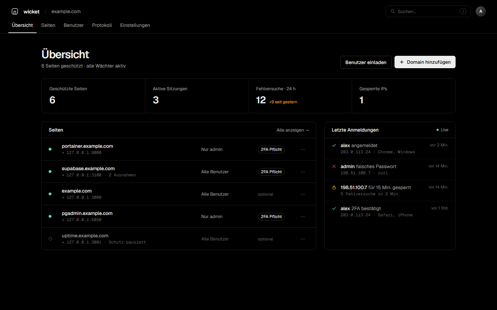

## Contents

- [Features](#features)
- [How it works](#how-it-works)
- [Requirements](#requirements)
- [Installation](#installation)
- [Protecting a site](#protecting-a-site)
- [Admin interface](#admin-interface)
- [Configuration](#configuration)
- [Security](#security)
- [Backup and updates](#backup-and-updates)
- [Building from source](#building-from-source)
- [Roadmap](#roadmap)

## Features

- **Own login page** instead of the browser's basic-auth popup.
- **Single sign-on.** One login is valid for every protected site under your domain.
- **Per-site rules.** Allow all users, admins only, or a selected list of users.
- **Public paths.** Keep individual paths open, for example `/healthz` or `/api/public/*`.
- **Two-factor authentication** with any authenticator app (TOTP), including ten single-use recovery codes.
  2FA can be required per site and enforced for all admins.
- **Brute-force protection.** An IP address is locked for a configurable time after repeated failed attempts.
- **Audit log** of every sign-in, failure, lock and admin change, with filters and CSV export.
- **Session management.** See active sessions per user and end them individually or all at once.
- **Automatic Caddy configuration.** Add a domain in the admin interface and Wicket writes the Caddy site block
  and reloads Caddy. The site is protected immediately.
- **Small and self-contained.** One static binary, no external services, no requests to third parties.

## How it works

```
Browser ──> Caddy ──(forward_auth)──> Wicket  /verify
              │                          │
              │   200 + Remote-User  <───┤  signed in and allowed
              │   302 to login page  <───┘  not signed in or not allowed
              ▼
         your service
```

1. Caddy asks Wicket before every request to a protected site (`forward_auth`).
2. If the visitor has a valid session and is allowed on that site, Wicket answers `200` and Caddy forwards the
   request. Wicket adds the headers `Remote-User` and `Remote-Role`, which your service can use.
3. Otherwise the visitor is redirected to the Wicket login page and sent back after signing in.
4. The session cookie is set for your main domain, so it is valid on all subdomains.

## Requirements

- A Linux server with Docker.
- [Caddy](https://caddyserver.com) v2 as reverse proxy, running on the same host.
- A domain with DNS records for two hosts, for example `login.example.com` (login page) and
  `wicket.example.com` (admin interface). Both point to your server.

## Installation

### 1. Prepare the directories

Wicket runs as the unprivileged user `65532`. It needs a data directory and a directory for its Caddy snippets:

```
mkdir -p /opt/wicket/data
sudo mkdir -p /etc/caddy/wicket
sudo chown 65532:65532 /opt/wicket/data /etc/caddy/wicket
```

To let Wicket protect site blocks that already exist in your Caddyfile, also allow it to edit the Caddyfile:

```
sudo chgrp 65532 /etc/caddy/Caddyfile
sudo chmod 664 /etc/caddy/Caddyfile
```

Without this step everything still works, but you add `import wicket` to existing blocks yourself.

### 2. Include Wicket in your Caddyfile

If the Caddyfile is writable for Wicket (previous step), Wicket adds this line itself and skips to step 3.
Otherwise add it to the top of your Caddyfile, before any site block (after the global options block, if you
have one):

```
import /etc/caddy/wicket/*.caddy
```

Wicket keeps its own files in this directory: the `wicket` snippet with the `forward_auth` configuration, the
site block for the login and admin hosts, and one block per site it manages for you.

The line has to come first because Caddy defines snippets in the order it reads the file. A site block above it
that uses `import wicket` fails with `Could not import wicket: is a directory`.

### 3. Start the container

Create `/opt/wicket/docker-compose.yml`:

```yaml
services:
  wicket:
    image: ghcr.io/johanneshehl/wicket:latest
    container_name: wicket
    restart: unless-stopped
    network_mode: host
    environment:
      WICKET_LISTEN: 127.0.0.1:9091
      WICKET_COOKIE_DOMAIN: example.com
      WICKET_LOGIN_HOST: login.example.com
      WICKET_ADMIN_HOST: wicket.example.com
    volumes:
      - ./data:/data
      - /etc/caddy:/etc/caddy
```

```
cd /opt/wicket
docker compose up -d
```

Host networking lets Caddy reach Wicket on `127.0.0.1:9091` and Wicket reach the Caddy admin API on
`127.0.0.1:2019`. Wicket only listens on localhost; all public traffic goes through Caddy.

### 4. First-run setup

On the first start Wicket prints a one-time setup code:

```
docker logs wicket
```

Open `https://wicket.example.com`, enter the setup code and create the first admin account. In the next step you
confirm the domain and hosts, then you set up two-factor authentication. After that the admin interface opens.

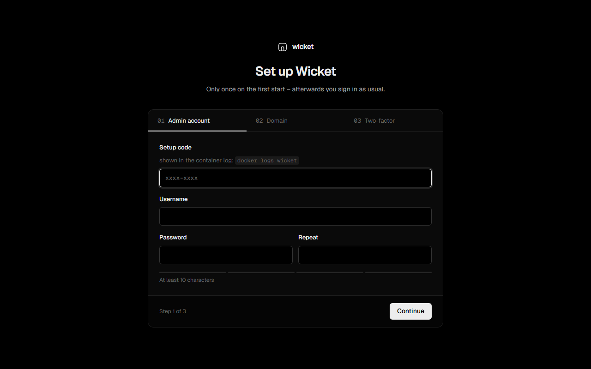

## Protecting a site

Open **Seiten** (sites) in the admin interface and click **Domain hinzufügen** (add domain).

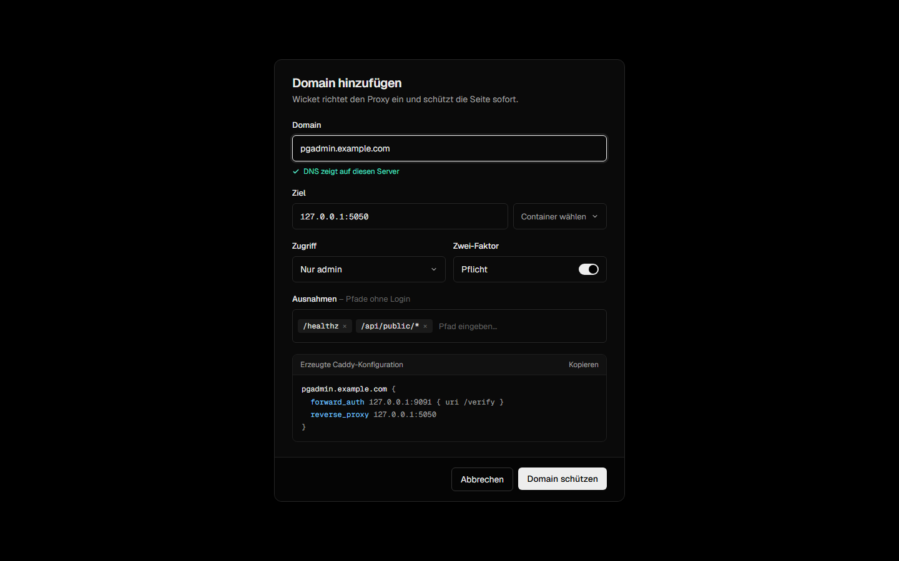

| Field | Meaning |
|---|---|
| Domain | The host name to protect, for example `app.example.com`. Wicket checks whether its DNS points to your server. |
| Target | Where the service runs, for example `127.0.0.1:8080` or `http://container:80`. |
| Access | All users, admins only, or selected users. Admins always have access. |
| Two-factor | Require 2FA for this site. Users without 2FA are asked to set it up first. |
| Public paths | Paths that stay reachable without login. Exact paths or a prefix ending in `*`. |
| Managed by Wicket | Wicket writes and maintains the Caddy block for this domain. |

### Managed sites

With **Caddy-Eintrag von Wicket anlegen lassen** enabled, Wicket creates this block and reloads Caddy:

```
app.example.com {
	import wicket
	reverse_proxy 127.0.0.1:8080
}
```

If Caddy rejects the configuration (for example because the domain is already defined in your Caddyfile),
Wicket restores the previous state and shows the error.

### Existing Caddy blocks

If a domain already has its own block in your Caddyfile, Wicket detects it while you type the domain and protects
that block instead of creating a second one. With a writable Caddyfile this is automatic:

- Wicket adds `import wicket # added by wicket` to the block.
- An existing `basic_auth` in the block is commented out (`# disabled by wicket: ...`), since Wicket replaces
  the browser's login popup.
- When you delete the site in Wicket, both changes are reverted.
- Before the first change, the original Caddyfile is saved as `Caddyfile.before-wicket` in the data directory.

```
app.example.com {
	import wicket # added by wicket
	# disabled by wicket: basic_auth {
	# disabled by wicket: 	admin $2a$14$...
	# disabled by wicket: }
	reverse_proxy 127.0.0.1:8080
}
```

If the Caddyfile is read-only for Wicket, add `import wicket` to the block yourself. This also works for wildcard
domains such as `*.apps.example.com`.

### Pausing protection

Every site has a switch in the list. A paused site stays reachable without login, and its rules are kept.

## Admin interface

The interface is currently in German. English and other languages are planned, see [Roadmap](#roadmap).

### Sign-in pages

The login page that visitors see in front of a protected site, and the second step with the authenticator code:

| Login | Two-factor step |
|---|---|
| 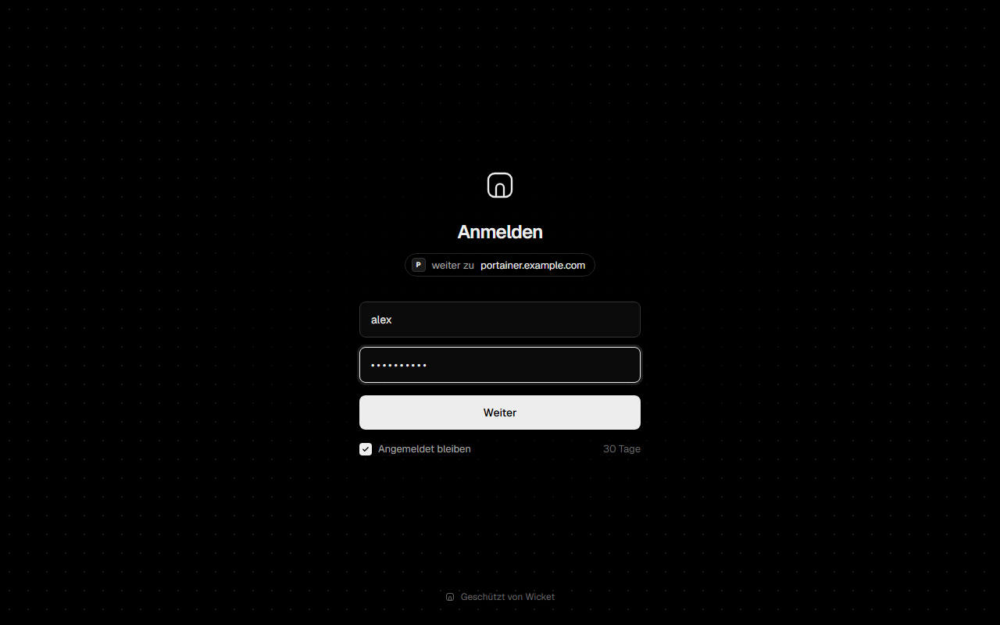 | 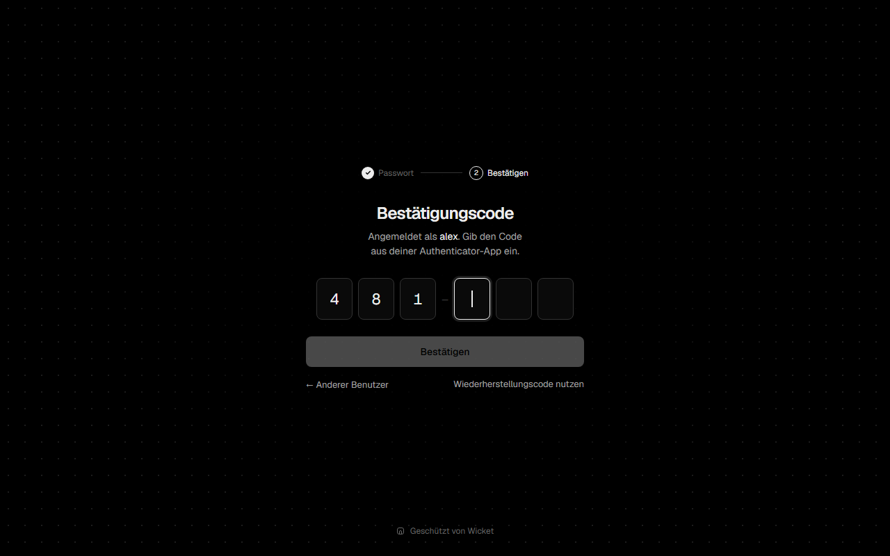 |

Wicket's own admin login:

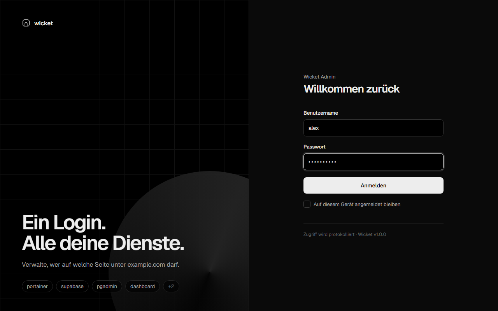

### Sites

All protected domains with target, access rule, 2FA requirement and public paths.

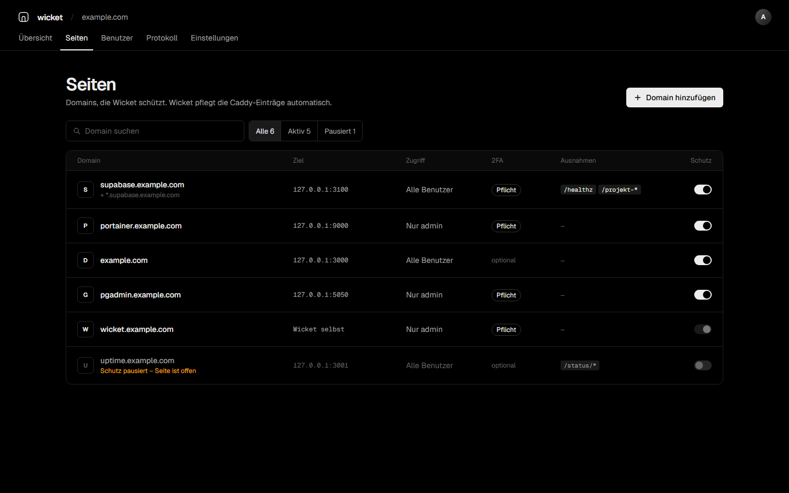

### Users

Users with role and 2FA status. The detail panel shows active sessions and lets you reset the password or 2FA
and sign the user out everywhere.

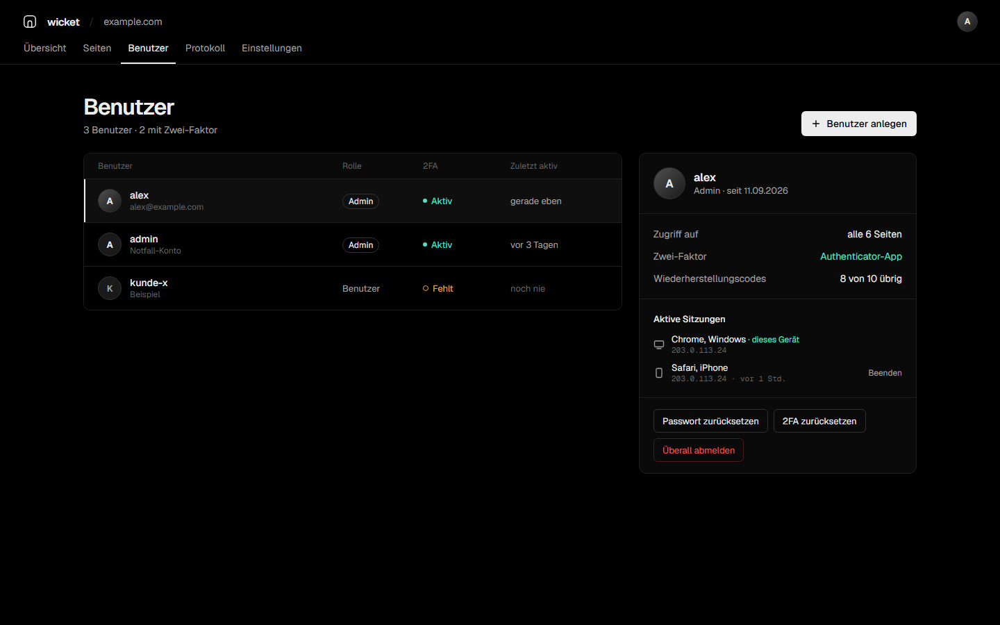

### Audit log

Every sign-in, failure, lock and admin change, filterable by type, time range and site, with CSV export.

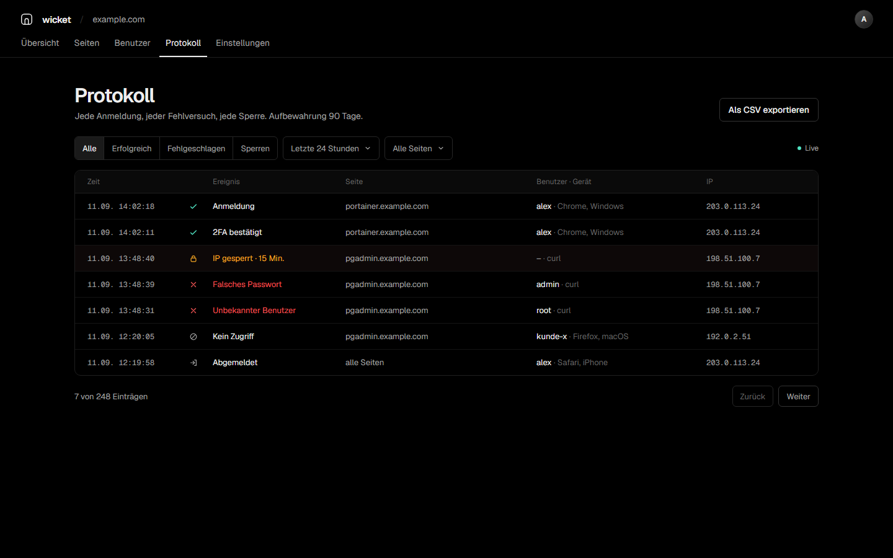

### Settings

Main domain and hosts, session length, brute-force limits, 2FA enforcement for admins, log retention, the status
of the Caddy connection and your own account.

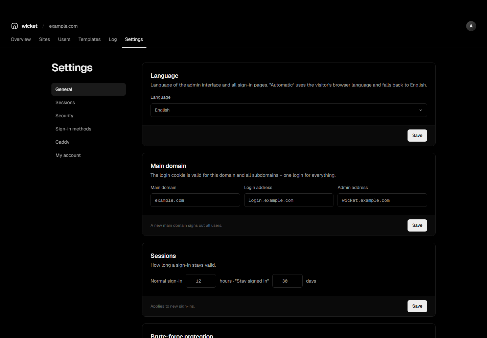

### Two-factor setup

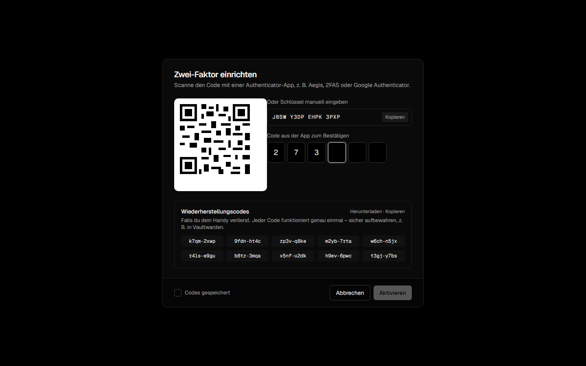

## Configuration

The environment variables provide the initial values. Domain, hosts, session length and lock rules can be changed
later in the admin interface; those values are stored in the database and take precedence.

| Variable | Default | Description |
|---|---|---|
| `WICKET_LISTEN` | `:9091` | Address Wicket listens on. Use `127.0.0.1:9091` with host networking. |
| `WICKET_DATA` | `/data` | Directory for the SQLite database. |
| `WICKET_COOKIE_DOMAIN` | | Main domain. The login is valid for this domain and all subdomains. |
| `WICKET_LOGIN_HOST` | | Host of the login page, for example `login.example.com`. |
| `WICKET_ADMIN_HOST` | | Host of the admin interface, for example `wicket.example.com`. |
| `WICKET_AUTH_ADDR` | `127.0.0.1:9091` | Address Caddy uses to reach Wicket in `forward_auth`. |
| `WICKET_CADDY_ADMIN` | `http://127.0.0.1:2019` | Caddy admin API, used to reload the configuration. |
| `WICKET_CADDY_DIR` | `/etc/caddy/wicket` | Directory for the managed Caddy snippets. If it does not exist, Caddy integration is off. |
| `WICKET_CADDYFILE` | `/etc/caddy/Caddyfile` | Caddyfile that is loaded on reload. If it is writable, Wicket keeps its import at the top and protects existing site blocks. |

Defaults in the admin interface:

| Setting | Default |
|---|---|
| Session length | 12 hours |
| "Stay signed in" | 30 days |
| Lock after | 5 failed attempts within 2 minutes |
| Lock duration | 15 minutes |
| Enforce 2FA for admins | on |
| Log retention | 90 days |

## Security

- Passwords are hashed with Argon2id. Unknown user names take as long as wrong passwords, so user names cannot be
  guessed from response times.
- Session tokens are random 256-bit values; only their SHA-256 hash is stored. The token is replaced after the
  second factor to prevent session fixation.
- Cookies are `HttpOnly`, `SameSite=Lax` and `Secure` behind HTTPS.
- Forms are protected with CSRF tokens; the admin API only accepts changes with a custom request header.
- Redirects after login only go to hosts inside your main domain.
- TOTP codes cannot be reused. Recovery codes are stored hashed and work exactly once.
- Public paths are normalised before matching, so `/healthz/../admin` does not pass as `/healthz`.
- The first admin can only be created with the setup code from the container log.
- Responses carry a strict Content Security Policy. Wicket makes no requests to third parties; fonts are bundled.
- The image is based on distroless and runs as a non-root user.

## Backup and updates

All data (users, sites, sessions, settings and the audit log) is in one SQLite file in the data directory. To back
it up, copy the directory, ideally while the container is stopped:

```
docker compose stop wicket
cp -a /opt/wicket/data /backup/wicket-$(date +%F)
docker compose start wicket
```

To update to the latest version:

```
docker compose pull
docker compose up -d
```

## Building from source

Requirements: Go 1.26 or Docker.

```
docker build -t wicket .
```

Or without Docker:

```
go build -o wicket .
WICKET_DATA=./data ./wicket
```

The end-to-end test starts against a fresh instance and covers setup, 2FA, the admin API, `forward_auth`,
access rules and brute-force protection:

```
WICKET_LISTEN=127.0.0.1:9092 WICKET_AUTH_ADDR=127.0.0.1:9092 WICKET_DATA=/tmp/wicket-test ./wicket
python3 scripts/e2e_test.py 9092 <setup-code>
```

Releases are built by GitHub Actions: pushing a tag like `v1.2.0` publishes the image for `linux/amd64` and
`linux/arm64` to `ghcr.io/johanneshehl/wicket` and creates a GitHub release.

## Roadmap

Planned for upcoming versions:

- **Multiple languages.** English interface, language selection per user, community translations.
- **Passkeys** (WebAuthn) as second factor or passwordless login.
- **Groups and roles** to manage access for many users at once.
- **Invitations and password reset by email** via SMTP.
- **OpenID Connect provider**, so applications like GitLab, Grafana or Portainer can use Wicket for their own login.
- **Traefik and nginx** in addition to Caddy.
- **Notifications** on sign-in from a new device, and when an IP address is locked.
- **Custom branding** with your own logo, colours and texts on the login page.
- **IP rules** to always allow or block networks, per site.
- **Per-site session length** and re-authentication for sensitive sites.
- **Metrics** endpoint for Prometheus.
- **Automatic discovery** of Docker containers as targets when adding a domain.

## Acknowledgements

Wicket uses the [Geist](https://vercel.com/font) typeface (SIL Open Font License 1.1),
[modernc.org/sqlite](https://gitlab.com/cznic/sqlite), [go-qrcode](https://github.com/skip2/go-qrcode) and
[golang.org/x/crypto](https://pkg.go.dev/golang.org/x/crypto).
